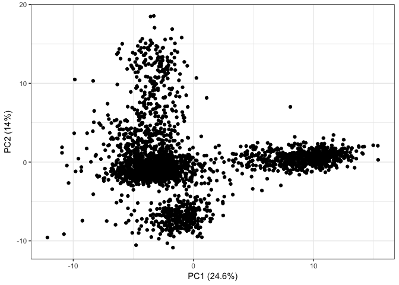

Table of Contents
-----------------

-   [Table of Contents](#table-of-contents)
-   [Introduction](#introduction)
-   [Setup](#setup)
-   [Data](#data)
-   [Analysis](#analysis)
    -   [Dimensionality reduction](#dimensionality-reduction)
        -   [Principal component analysis](#principal-component-analysis)
        -   [t-distributed stochastic neighbour embedding (t-SNE)](#t-distributed-stochastic-neighbour-embedding-t-sne)
    -   [Clustering](#clustering)
        -   [k-medoids clustering](#k-medoids-clustering)
    -   [Differential expression](#differential-expression)
        -   [Methods for single-cell analysis](#methods-for-single-cell-analysis)
        -   [Setting up an edgeR likelihood ratio test](#setting-up-an-edger-likelihood-ratio-test)
        -   [Genes underexpressed in cluster 1 relative to 2](#genes-underexpressed-in-cluster-1-relative-to-2)
        -   [Genes overexpressed in cluster 1 relative to 2](#genes-overexpressed-in-cluster-1-relative-to-2)
    -   [Comparison to Seurat-annotated clusters](#comparison-to-seurat-annotated-clusters)
    -   [Session info](#session-info)
    -   [References](#references)

Introduction
============

The purpose of the tutorial is to provide an introduction to dimensionality reduction, visualization, basic clustering and differential expression methods applicable to single-cell RNA-seq (scRNA-seq) data. We'll be using a public set of single-cell RNA-seq data provided by 10X genomics (10xGenomics 2017).

For the most part, the methods described in this tutorial can also be used in the context of RNA-seq analysis for bulk samples. Certain code chunks are optimized for speed to handle the high volume of data from scRNA-seq.

Setup
=====

We'll begin by installing the required packages. If you have trouble installing any of these packages, make sure you update to the latest RStudio version (otherwise, if you haven't installed it before, `tidyverse` may throw errors).

``` r
if (!require("pacman")) install.packages("pacman")

pacman::p_load(tidyverse, Seurat, stringr, Rtsne, cluster, limma, edgeR, statmod)
```

This should automatically install any packages you're missing (and just load them if you have them already).

Next, navigate to the directory containing `tutorial.Rmd` within RStudio and set that to your working directory.

Data
====

We're going to use the single-cell RNA-seq data for 2700 peripheral blood mononuclear cells (PBMCs) available from 10X genomics (provided by the R package Seurat). PBMCs include:

-   T cells
-   B cells
-   NK cells
-   monocytes

Load the data in as:

``` r
load("../data/pbmc3k_final.Rda")
```

An object named `pbmc` should appear in the global environment.

``` r
class(pbmc)
```

    ## [1] "seurat"
    ## attr(,"package")
    ## [1] "Seurat"

The expression data has been pre-bundled into a Seurat object. We'll work with the individual components.

-   `pbmc@raw.data` contains the transcript (technically, UMI) counts for each gene,cell pair
-   `pbmc@scale.data` contains the log-normalized and scaled version of the above

If you've worked with bulk RNA-seq data before this should be fairly familiar -- just consider cells as samples.

Extract the raw and scaled matrices:

``` r
data_matrix_scaled <- pbmc@scale.data
data_matrix_raw <- as.matrix(pbmc@raw.data[pbmc@var.genes, colnames(data_matrix_scaled)])

dim(data_matrix_raw)
```

    ## [1] 1838 2638

``` r
dim(data_matrix_scaled)
```

    ## [1] 1838 2638

What we've done here is only look at the genes with variable expression levels, as these tend to be the most interesting for looking at differential expression. Prior to this filtering step, we had 13714 genes. Seurat does this for us, so let's not worry about it.

Some cells are also removed as part of quality control for a variety of reasons (e.g. low total transcript count, high mitochondrial transcript expression) -- the ones kept are stored in `colnames(data_matrix_scaled)`.

Note that the expression matrix is sparse -- unlike in bulk gene expression data, where collections of cells are assessed, 0 transcripts are detected for a substantial portion of genes in most types of single cell data.

Analysis
========

Dimensionality reduction
------------------------

The first thing we want to get an idea of is what the data look like. Since we're looking at PBMC, we might expect to have multiple clusters of cells with similar expression, i.e. a cluster for T cells, another for B cells ...

It's usually prudent to re-scale the data prior to dimensionality reduction -- so we'll work with `data_matrix_scaled`.

### Principal component analysis

#### Introduction

The goal of PCA is to find a linear combination of mutually orthogonal "principal components" that approximate the original data as closely as possible. We can select the number of principal components we want -- more principal components = closer approximation to the data.

For our starting expression data for N cells x D genes, the maximum number of principal components we can select is `min(N,D)`. Let's say we want 20 PCs. Then PCA will give us 2 resulting matrices:

-   A N-by-20 matrix containing the *factor scores*: the values of each PC for each cell
-   A 20-by-D matrix containing the *loadings*: the linear transformation converting a vector of PC values to a vector of expression values for all D genes

such that the product of these 2 matrices approximates the original expression matrix.

Which of these matrices would we likely be interested in visualizing?

#### Applying PCA

With speed in mind, we'll use the `irlba` function, rather than `prcomp/princomp`, to compute the first 20 PCs.

``` r
components <- 20

pca_results <- irlba::irlba(A = t(data_matrix_scaled), nv = components)
```

Our resulting matrices are:

``` r
dim(pca_results$u)
```

    ## [1] 2638   20

``` r
dim(pca_results$v)
```

    ## [1] 1838   20

The variance of each component can be computed as:

``` r
sdev <- pca_results$d  ## singular values, related to eigenvalues, which are related to the variance of each component
vars <- sdev^2/sqrt(max(1, ncol(data_matrix_scaled) - 1))  ## variances of each component
frac_vars <- vars/sum(vars)
```

#### Visualization

Recall that the factor scores give us the PC values for each cell.

``` r
factor_scores <- pca_results$u %*% diag(pca_results$d) %>% as.data.frame
colnames(factor_scores) <- paste0("PC", 1:ncol(factor_scores))
rownames(factor_scores) <- colnames(data_matrix_scaled)
factor_scores <- factor_scores %>% tibble::rownames_to_column(var = "cell")

p <- ggplot(factor_scores, aes(x = PC1, y = PC2)) + geom_point() + theme_bw() + 
    xlab(paste0("PC1 (", round(frac_vars[1], 3) * 100, "%)")) + ylab(paste0("PC2 (", 
    round(frac_vars[2], 2) * 100, "%)"))

p
```



### t-distributed stochastic neighbour embedding (t-SNE)

#### Introduction

Like PCA, t-SNE is a method for dimensionality reduction. Unlike PCA, t-SNE can find a nonlinear mapping between the original data and the low-dimensional "components".

#### Applying t-SNE

For the purposes of visualization we're only interested in 2 dimensions, so we'll do 2D t-SNE. This might take a minute or so to run.

``` r
dims <- 2
```

``` r
tsne_results <- Rtsne(X = t(data_matrix_scaled), dims = dims, initial_dims = 50)
```

To tractably do t-SNE, what's often done is that PCA is first applied -- and only the top X components (`initial_dims`) are kept.

If this takes too long to run or you're just impatient, load in the version I've already run, i.e.:

``` r
tsne_results <- readRDS("../intermediates/tsne_results.rds")
```

#### Plotting

``` r
tsne_df <- data.frame(tsne_results$Y)
colnames(tsne_df) <- c("TSNE1", "TSNE2")
tsne_df$cell <- colnames(data_matrix_scaled)
```

``` r
p <- ggplot(tsne_df, aes(x = TSNE1, y = TSNE2)) + geom_point() + theme_bw() + 
    xlab("TSNE1") + ylab("TSNE2")

p
```


Visually, we can identify approx. 3-5 clusters depending on how hard you squint.

Clustering
----------

Although we can see structure from doing PCA/t-SNE, we still have to derive cluster assignments for each cell.

### k-medoids clustering

For simplicity and speed we'll use a simple clustering method, k-medoids. Briefly, this takes the set of N cells and splits it into k clusters, minimizing the distance between 'cluster centers' and the points in each cluster.

We'll run this on the first 20 PCs.

``` r
pam_results <- pam(factor_scores, k = 5, metric = "euclidean", diss = FALSE)

tsne_df$cluster <- pam_results$clustering
```

*Note:* Formally speaking we should have done this for many values of `k`, e.g. from 2-15 and selected `k` based on those results (e.g. see elbow method, silhouette method, ...).

``` r
p <- ggplot(tsne_df, aes(x = TSNE1, y = TSNE2)) + geom_point(aes(colour = factor(cluster))) + 
    theme_bw() + xlab("TSNE1") + ylab("TSNE2") + guides(colour = guide_legend(title = "Cluster")) + 
    scale_colour_brewer(palette = "Set2")

p
```


Visually, this looks mostly good.

Differential expression
-----------------------

Ok, we've got clusters now -- what do the cells in each cluster represent biologically? e.g. which clusters are T cells?

With some knowledge of the genes expressed by each cell type relative to other PBMC, we can identify these clusters by doing differential expression (DE) analysis.

### Methods for single-cell analysis

Surprisingly (or perhaps not), most DE methods designed for single-cell RNA-seq data actually perform more poorly than those for bulk data (or even simple pairwise Wilcoxon tests!) in the most comprehensive comparison of scRNA-seq DE methods to date I know of (Soneson and Robinson 2017).

One of the DE methods that did very well was edgeR's likelihood ratio test, which we'll use for the following analysis.

### Setting up an edgeR likelihood ratio test

voom-limma was designed to operate on transcript counts, so we'll use the raw data stored in `data_matrix_raw`.

First, we'll set up the design matrix, which is just a fancy way of saying sample annotations -- in this case, cell annotations.

``` r
cluster_label <- paste0("C", tsne_df$cluster)

design <- model.matrix(~0 + cluster_label)
colnames(design) <- paste0("C", 1:5)
```

These annotations are the clusters we produced above.

Now we'll fit a glm in edgeR. Estimating dispersions might take a few minutes, so you'll probably want to skip that step. To do so, you can alternatively load the pre-computed version.

``` r
d <- DGEList(data_matrix_raw)
d <- calcNormFactors(d)

d <- estimateDisp(d, design)
fit <- glmFit(d, design, robust = TRUE)
```

``` r
fit <- readRDS("../intermediates/edgeR_glmfit.rds")
```

Let's say we're interested in analyzing the differences between clusters 1 and 2. To do so, we use a contrast matrix to test the significance (non-zero) of `C1 - C2`:

``` r
contrast.matrix <- limma::makeContrasts(C1 - C2, levels = design)
colnames(contrast.matrix) <- c("C1C2")
```

Then, we perform the likelihood ratio test:

``` r
results <- glmLRT(fit, coef = "C1 - C2", contrast = contrast.matrix)
c1_c2_genes <- edgeR::topTags(results, adjust.method = "BH", n = Inf, sort.by = "PValue")
```

### Genes underexpressed in cluster 1 relative to 2

``` r
head(c1_c2_genes$table %>% subset(logFC < 0), 20)
```

    ##               logFC   logCPM        LR        PValue           FDR
    ## CD79A     -4.656100 13.34508 2702.8913  0.000000e+00  0.000000e+00
    ## CD79B     -3.810178 13.35332 1955.0247  0.000000e+00  0.000000e+00
    ## MS4A1     -3.680759 13.18541 1582.0883  0.000000e+00  0.000000e+00
    ## HLA-DRB1  -3.663803 14.09938 1501.5120  0.000000e+00  0.000000e+00
    ## HLA-DPA1  -3.564842 14.11855 1436.9569 1.957404e-314 7.195417e-312
    ## HLA-DPB1  -3.601532 14.21639 1383.2595 9.124093e-303 2.795014e-300
    ## TCL1A     -3.890010 13.16373 1210.0375 4.016825e-265 1.054703e-262
    ## HLA-DQB1  -3.669110 13.35886 1196.6703 3.228053e-262 7.416451e-260
    ## HLA-DQA1  -3.940054 13.38675 1135.6442 5.914615e-249 1.207896e-246
    ## LINC00926 -3.139157 13.06707  862.8675 1.159233e-189 2.130671e-187
    ## HLA-DMA   -3.133426 13.32050  839.3670 1.490140e-184 2.282398e-182
    ## CD37      -1.785362 14.05902  697.5101 1.040293e-153 1.470814e-151
    ## HLA-DMB   -2.668740 13.15540  560.3458 7.069458e-124 9.281189e-122
    ## IGLL5     -3.916222 13.14004  446.7229  3.726635e-99  4.566370e-97
    ## IRF8      -2.375949 13.07086  389.1118  1.291952e-86  1.396828e-84
    ## HVCN1     -2.339032 13.08085  381.5225  5.800967e-85  5.923431e-83
    ## FCRLA     -2.118700 13.00512  352.8925  9.937231e-79  9.612964e-77
    ## EAF2      -2.089938 13.04233  349.8947  4.467609e-78  4.105733e-76
    ## HLA-DOB   -1.933692 13.00114  337.6400  2.083744e-75  1.823772e-73
    ## CD72      -1.894505 13.00289  293.5353  8.438268e-66  6.743277e-64

-   CD79a/CD79b: components of the B-cell receptor (BCR) expressed on B cells
-   MS4A1: encodes CD20. Expressed on most B cells (not plasma cells)
-   HLA-D..: Major histocompatibility complex class II molecules expressed by professional antigen presenting cells (including B cells)

### Genes overexpressed in cluster 1 relative to 2

``` r
head(c1_c2_genes$table %>% subset(logFC > 0), 20)
```

    ##            logFC   logCPM        LR        PValue           FDR
    ## IL32    3.693076 14.01263 844.87226 9.470024e-186 1.582355e-183
    ## GIMAP7  2.776935 13.60654 434.33283  1.852930e-96  2.128554e-94
    ## GIMAP4  2.432430 13.44965 298.78646  6.055690e-67  5.059254e-65
    ## CD2     2.344373 13.32358 255.76902  1.434819e-57  1.014307e-55
    ## GIMAP5  2.232089 13.27217 196.97931  9.528826e-45  4.864995e-43
    ## FYB     2.014291 13.33835 190.31604  2.712357e-43  1.278285e-41
    ## CTSW    1.917215 13.41861 178.01571  1.314269e-40  5.751493e-39
    ## S100A6  1.153742 14.56501 166.75656  3.780982e-38  1.616150e-36
    ## CD247   1.772815 13.24515 163.57954  1.869023e-37  7.807418e-36
    ## CCL5    2.747803 13.98189 154.28389  2.007649e-35  8.021865e-34
    ## NKG7    2.349794 14.17543 150.28128  1.504802e-34  5.644544e-33
    ## GZMA    1.888913 13.33390 144.56130  2.678383e-33  9.845735e-32
    ## MAL     1.718024 13.10072 114.18320  1.188088e-26  3.899473e-25
    ## AQP3    1.577085 13.14269  97.21046  6.233633e-23  1.847971e-21
    ## ID2     1.393940 13.45703  89.18097  3.602986e-21  1.034733e-19
    ## ITM2A   1.404033 13.07743  86.09332  1.716418e-20  4.772793e-19
    ## CST7    1.362283 13.33311  84.97253  3.025387e-20  8.058930e-19
    ## GIMAP2  1.310656 13.13706  76.06322  2.747271e-18  6.917100e-17
    ## ZAP70   1.208703 13.08357  74.49937  6.065752e-18  1.506602e-16
    ## LDLRAP1 1.277641 13.07270  74.10517  7.406419e-18  1.815066e-16

-   IL32: Expressed after T cell or NK cell activation
-   GZMA: Marker of cytotoxic T cells and NK cells
-   FYB: Involved in signalling cascades in T cells (<http://www.genecards.org/cgi-bin/carddisp.pl?gene=FYB1>)
-   CCL5: Also known as RANTES (regulated on activation, normal T cell expressed and secreted)

*Note:* When working with single-cell RNA-seq data, eliminating lowly expressed genes prior to doing DE analysis can be a good idea. Also, we could have done gene set enrichment analysis, etc.

Comparison to Seurat-annotated clusters
---------------------------------------

How do these results compare to the "real" clusters?

``` r
tsne_df$annotated_celltype <- pbmc@meta.data[tsne_df$cell, ]$ClusterNames_0.6

with(tsne_df, table(annotated_celltype, cluster))
```

    ##                    cluster
    ## annotated_celltype     1    2    3    4    5
    ##   B cells              4  339    0    0    0
    ##   CD14+ Monocytes      0    0    7    0  471
    ##   CD4 T cells       1146    0    0    0    3
    ##   CD8 T cells        228    1    1   78    0
    ##   Dendritic cells      7   11    0    0   14
    ##   FCGR3A+ Monocytes    0    0  156    0    2
    ##   Megakaryocytes       1    0   13    0    1
    ##   NK cells             2    0    0  153    0

Session info
------------

``` r
sessionInfo()
```

    ## R version 3.3.2 (2016-10-31)
    ## Platform: x86_64-apple-darwin13.4.0 (64-bit)
    ## Running under: OS X El Capitan 10.11.5
    ## 
    ## locale:
    ## [1] en_CA.UTF-8/en_CA.UTF-8/en_CA.UTF-8/C/en_CA.UTF-8/en_CA.UTF-8
    ## 
    ## attached base packages:
    ## [1] parallel  stats     graphics  grDevices utils     datasets  methods  
    ## [8] base     
    ## 
    ## other attached packages:
    ##  [1] statmod_1.4.30      edgeR_3.14.0        limma_3.28.21      
    ##  [4] cluster_2.0.5       Rtsne_0.11          Seurat_2.0.1       
    ##  [7] Biobase_2.32.0      BiocGenerics_0.18.0 Matrix_1.2-7.1     
    ## [10] cowplot_0.8.0       forcats_0.2.0       stringr_1.2.0      
    ## [13] dplyr_0.7.4         purrr_0.2.4         readr_1.1.1        
    ## [16] tidyr_0.7.2         tibble_1.3.4        ggplot2_2.2.1      
    ## [19] tidyverse_1.2.1     pacman_0.4.6        setwidth_1.0-4     
    ## 
    ## loaded via a namespace (and not attached):
    ##   [1] readxl_1.0.0         backports_1.0.5      Hmisc_4.0-3         
    ##   [4] VGAM_1.0-3           NMF_0.20.6           sn_1.5-0            
    ##   [7] plyr_1.8.4           igraph_1.1.2         lazyeval_0.2.0      
    ##  [10] splines_3.3.2        gridBase_0.4-7       digest_0.6.12       
    ##  [13] foreach_1.4.3        htmltools_0.3.6      lars_1.2            
    ##  [16] gdata_2.17.0         magrittr_1.5         checkmate_1.8.2     
    ##  [19] doParallel_1.0.10    mixtools_1.1.0       ROCR_1.0-7          
    ##  [22] modelr_0.1.1         R.utils_2.3.0        colorspace_1.3-2    
    ##  [25] rvest_0.3.2          haven_1.1.0          crayon_1.3.4        
    ##  [28] jsonlite_1.5         lme4_1.1-13          bindr_0.1           
    ##  [31] survival_2.41-3      iterators_1.0.8      ape_4.1             
    ##  [34] glue_1.2.0           registry_0.3         gtable_0.2.0        
    ##  [37] MatrixModels_0.4-1   car_2.1-4            kernlab_0.9-25      
    ##  [40] prabclus_2.2-6       DEoptimR_1.0-8       SparseM_1.77        
    ##  [43] scales_0.4.1         mvtnorm_1.0-6        rngtools_1.2.4      
    ##  [46] Rcpp_0.12.13         dtw_1.18-1           xtable_1.8-2        
    ##  [49] htmlTable_1.9        tclust_1.3-1         foreign_0.8-67      
    ##  [52] proxy_0.4-17         mclust_5.3           SDMTools_1.1-221    
    ##  [55] Formula_1.2-1        tsne_0.1-3           stats4_3.3.2        
    ##  [58] htmlwidgets_0.8      httr_1.3.1           FNN_1.1             
    ##  [61] gplots_3.0.1         RColorBrewer_1.1-2   fpc_2.1-10          
    ##  [64] acepack_1.3-3.3      modeltools_0.2-21    ica_1.0-1           
    ##  [67] pkgconfig_2.0.1      R.methodsS3_1.7.1    flexmix_2.3-14      
    ##  [70] nnet_7.3-12          caret_6.0-76         labeling_0.3        
    ##  [73] rlang_0.1.4          reshape2_1.4.2       munsell_0.4.3       
    ##  [76] cellranger_1.1.0     tools_3.3.2          cli_1.0.0           
    ##  [79] ranger_0.8.0         ggridges_0.4.1       broom_0.4.2         
    ##  [82] evaluate_0.10        yaml_2.1.14          ModelMetrics_1.1.0  
    ##  [85] knitr_1.16           robustbase_0.92-7    caTools_1.17.1      
    ##  [88] bindrcpp_0.2         pbapply_1.3-3        nlme_3.1-128        
    ##  [91] quantreg_5.33        formatR_1.4          R.oo_1.20.0         
    ##  [94] xml2_1.1.1           pbkrtest_0.4-7       rstudioapi_0.7      
    ##  [97] ggjoy_0.4.0          stringi_1.1.5        lattice_0.20-34     
    ## [100] trimcluster_0.1-2    psych_1.6.12         nloptr_1.0.4        
    ## [103] diffusionMap_1.1-0   irlba_2.3.1          data.table_1.10.4   
    ## [106] bitops_1.0-6         R6_2.2.1             latticeExtra_0.6-28 
    ## [109] KernSmooth_2.23-15   gridExtra_2.2.1      codetools_0.2-15    
    ## [112] MASS_7.3-45          gtools_3.5.0         assertthat_0.2.0    
    ## [115] pkgmaker_0.22        rprojroot_1.2        mnormt_1.5-5        
    ## [118] diptest_0.75-7       mgcv_1.8-15          hms_0.3             
    ## [121] grid_3.3.2           rpart_4.1-10         class_7.3-14        
    ## [124] minqa_1.2.4          rmarkdown_1.4        segmented_0.5-1.4   
    ## [127] numDeriv_2016.8-1    scatterplot3d_0.3-40 lubridate_1.7.1     
    ## [130] base64enc_0.1-3

References
----------

10xGenomics. 2017. “pbmc3k - Datasets - Single Cell Gene Expression - Official 10x Genomics Support.” Accessed November 24. <https://support.10xgenomics.com/single-cell-gene-expression/datasets/1.0.0/pbmc3k>.

Soneson, Charlotte, and Mark D. Robinson. 2017. “Bias, Robustness and Scalability in Differential Expression Analysis of Single-Cell RNA-Seq Data.” *Doi.org*, May. Cold Spring Harbor Laboratory, 143289. doi:[10.1101/143289](https://doi.org/10.1101/143289).
